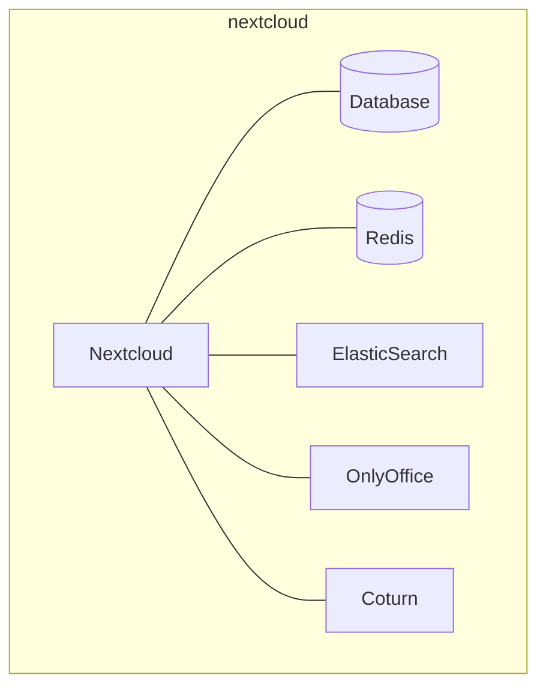
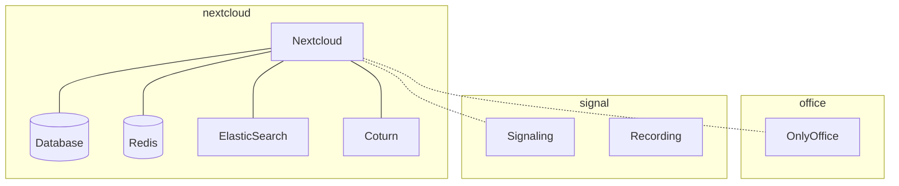
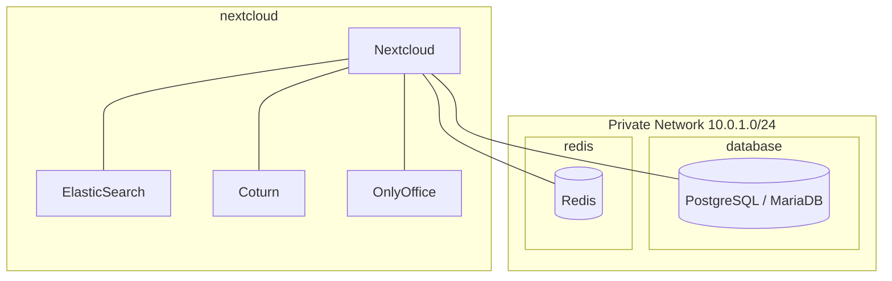

# Nextcloud Cloud Provisioning

A Pulumi program that provisions Nextcloud infrastructure across
**multiple cloud providers**. Compute and DNS are independent axes — you can
freely mix Hetzner Cloud servers with Cloudflare DNS, or Scaleway instances
with Hetzner DNS.

## Provider Support

### Compute

| Provider | Servers | Firewalls | Private Networks |
|----------|:---:|:---:|:---:|
| Hetzner Cloud | ✅ | ✅ | ✅ |
| Scaleway | 🟠 | 🟠 | 🟠 |

### DNS

| Provider | A / AAAA Records |
|----------|:---:|
| Hetzner Cloud | ✅ |
| Scaleway Domains | 🟠 |
| Cloudflare | 🟠 |

### Managed Services

| Provider | Database | Redis |
|----------|:---:|:---:|
| Scaleway | 🟠 | 🟠 |

✅ = tested &nbsp;&nbsp; 🟠 = not tested yet

## Requirements

- Pulumi CLI
- Python 3.10+
- Provider credentials (see [Configuration](#configuration))

## Project Structure

```
cloud-stuff/
  __main__.py          Orchestrator — reads config, instantiates plugins
  cloud_init.py        Shared cloud-init user-data generation
  ssh_waiter.py        Dynamic provider that waits for SSH connectivity
  compute/
    __init__.py        Abstract ComputeProvider + parse_server_spec helper
    hetzner.py         Hetzner Cloud implementation
    scaleway.py        Scaleway implementation
    firewall_policy.py Provider-neutral firewall rule profiles
  dns/
    __init__.py        Abstract DnsProvider + NullDnsProvider
    hetzner.py         Hetzner Cloud DNS (pulumi-hcloud ZoneRrset)
    scaleway.py        Scaleway Domains (native resource)
    cloudflare.py      Cloudflare (pulumi-cloudflare)
  managed/
    __init__.py        ManagedDatabaseResult / ManagedRedisResult dataclasses
    scaleway.py        Scaleway Managed Database + Redis
  docs/                Deep-dive documentation
  Pulumi.yaml
  Pulumi.nextcloud.yaml.example
  requirements.txt
  list_hcloud_catalog.py    Hetzner image/type catalog helper
  list_scaleway_catalog.py  Scaleway image/type catalog helper
  test_matrix.sh            Cross-distribution test runner
```

## Deployment Variants

The following combinations can be deployed:

- **Single server** — Nextcloud with all services on one host
- **Multi-server** — Office and Signal on dedicated servers
- **Split database / cache** — Database and Redis on separate servers in a private network

### Single Server



### Multi-Server: Dedicated Office + Signal



> **Note:** Signal (HPB + recording) always requires a dedicated server.
> Collocated deployment on the Nextcloud host is not supported.

### Multi-Server: Dedicated Database + Redis (Private Network)



> **Note:** Deploying database and Redis on separate servers in a private
> network is work in progress.

## Quick Start

```bash
cd cloud-stuff

python -m venv .venv
source .venv/bin/activate
pip install -r requirements.txt

# Initialise (first time only):
pulumi login --local
pulumi stack init production

# IMPORTANT: Copy the encryptionsalt line from the stack file that
# "pulumi stack init" just created into your copied config file.
# It is at the very top and is required to decrypt secrets:
#   encryptionsalt: v1:xxxxxxxx:v1:...

# Copy the example config:
cp Pulumi.nextcloud.yaml.example Pulumi.production.yaml

# Set secrets (stored encrypted in the stack file):
pulumi config set hetzner:token <HCLOUD-COMPUTE-TOKEN> --secret
pulumi config set hetznerDns:token <HCLOUD-DNS-TOKEN> --secret

# For Scaleway + Cloudflare instead:
# pulumi config set scaleway:accessKey <ACCESS-KEY> --secret
# pulumi config set scaleway:secretKey <SECRET-KEY> --secret
# pulumi config set cloudflare:apiToken <CF-TOKEN> --secret

# Edit Pulumi.production.yaml to set remaining config
# (provider, servers, zoneName, sshPubKey, etc.)

# Deploy:
pulumi up
```

## Catalog Helpers

Use these scripts to list valid values for stack files before editing
`servers[].image` (optional, overrides global `image`), `servers[].server_type` (Hetzner) or
`servers[].commercial_type` (Scaleway).

### Hetzner

```bash
cd cloud-stuff

export HCLOUD_TOKEN="your-token"
# or
export HCLOUD_TOKEN=$(cd pulumi config get hetzner:token --stack <your-stack>)

python list_hcloud_catalog.py
```

Options:

```bash
python list_hcloud_catalog.py --all-images
python list_hcloud_catalog.py --location fsn1
```

### Scaleway

```bash
cd cloud-stuff
export SCW_SECRET_KEY="your-secret-key"
python list_scaleway_catalog.py --zone fr-par-1
```

Options:

```bash
python list_scaleway_catalog.py --all-images
python list_scaleway_catalog.py --zone nl-ams-1
```

## Configuration

### Provider Selection

| Key | Required | Values | Description |
|-----|----------|--------|-------------|
| `nextcloud-wizard:computeProvider` | yes | `hetzner`, `scaleway` | Which cloud runs the servers |
| `nextcloud-wizard:dnsProvider` | no | `hetzner`, `scaleway`, `cloudflare`, `none` | Where DNS records are created (default: `none`) |

### Common Settings

| Key | Required | Default | Description |
|-----|----------|---------|-------------|
| `nextcloud-wizard:sshPubKey` | yes | — | SSH public key for the Ansible user |
| `nextcloud-wizard:zoneName` | cond. | — | DNS zone (required when `dnsProvider` ≠ `none`) |
| `nextcloud-wizard:environment` | no | *(stack name)* | Environment label / tag |
| `nextcloud-wizard:image` | no | `debian-13` | Default OS image for all servers (can be overridden per server) |
| `nextcloud-wizard:network` | no | *(none)* | Private network definition (see below) |
| `nextcloud-wizard:servers` | no | 1× `cx32` | Server definitions (see below) |

### Hetzner Compute Credentials

Required when `computeProvider: hetzner`.

| Key | Required | Default | Description |
|-----|----------|---------|-------------|
| `hetzner:token` | yes | — | Hetzner Cloud API token (`--secret`) |
| `hetzner:sshKeyName` | yes | — | Name of an existing SSH key in Hetzner |
| `hetzner:location` | no | `fsn1` | Datacenter location |

### Scaleway Compute Credentials

Required when `computeProvider: scaleway`.

| Key | Required | Default | Description |
|-----|----------|---------|-------------|
| `scaleway:accessKey` | yes | — | API access key (`--secret`) |
| `scaleway:secretKey` | yes | — | API secret key (`--secret`) |
| `scaleway:projectId` | yes | — | Project ID |
| `scaleway:region` | no | `fr-par` | Region |
| `scaleway:zone` | no | `fr-par-1` | Availability zone |

### DNS Credentials

Only the credentials for the chosen `dnsProvider` are needed.

| Provider | Key | Description |
|----------|-----|-------------|
| Hetzner | `hetznerDns:token` | Hetzner Cloud API token for DNS project (`--secret`) |
| Hetzner | `hetznerDns:zoneId` | Optional zone ID override (auto-detected from `zoneName`) |
| Cloudflare | `cloudflare:apiToken` | API token (`--secret`) |
| Cloudflare | `cloudflare:zoneId` | Optional zone ID override (auto-detected from `zoneName`) |
| Scaleway | *(none)* | Reuses the Scaleway compute provider credentials |

### Server Definition

Each entry in the `servers` list supports:

| Field | Required | Default | Provider | Description |
|-------|----------|---------|----------|-------------|
| `name` | yes | — | all | Hostname and DNS record name |
| `image` | no | from `nextcloud-wizard:image` | all | OS image override per server (`debian-13`, `debian_bookworm`, …) |
| `server_type` | no | `cx32` | Hetzner | Hetzner server type |
| `commercial_type` | no | `DEV1-L` | Scaleway | Scaleway instance type |
| `networks` | no | `[public]` | all | `public`, `private`, or both |
| `server_groups` | no | `[]` | all | Ansible groups (labels / tags) |
| `public_firewall_rules` | no | `[ssh, letsencrypt, nextcloud]` | all | Public-facing firewall rule sets (provider-neutral) |
| `dns_aliases` | no | `[]` | all | Legacy-compatible extra DNS A records |
| `additional_fqdn_<name>` | no | — | all | Named extra FQDN (e.g. `additional_fqdn_recording`) |
| `additional_fqdns` | no | `{}` | all | Map form for named FQDNs (`recording`, `onlyoffice`, …) |

`additional_fqdn_*` and `additional_fqdns` values are normalized the same way
as server names: if no full FQDN is provided, `.zoneName` is appended
automatically. These are used for webserver vhosts when multiple services
(e.g. signaling + recording) share the same server.

For new setups, prefer `additional_fqdn_<name>` or `additional_fqdns`.
`dns_aliases` remains supported for backward compatibility.

### Private Network (WIP)

Only created when the `network` block is present.

**Hetzner:**

```yaml
nextcloud-wizard:network:
  name: nextcloud-net
  ip_range: 10.0.0.0/16
  subnet: 10.0.1.0/24
```

**Scaleway:**

```yaml
nextcloud-wizard:network:
  name: nextcloud-net
```

Servers with `private` in their `networks` list are attached to the network.

### Managed Database (Scaleway only) (WIP)

When the `managedDatabase` block is present and `computeProvider: scaleway`, a Scaleway Managed Database is provisioned:

```yaml
nextcloud-wizard:managedDatabase:
  engine: PostgreSQL-16          # or MySQL-8
  node_type: DB-DEV-S
  name: nextcloud-db
  db_name: nextcloud
  user_name: nextcloud
  # volume_type: lssd            # lssd (default) | sbs_5k | sbs_15k
  # volume_size_in_gb: 20        # only for sbs_* types
  # is_ha_cluster: false
  # disable_backup: false
nextcloud-wizard:dbPassword:
  secure: v1:<password>
```

### Managed Redis (Scaleway only) (WIP)

When the `managedRedis` block is present and `computeProvider: scaleway`, a Scaleway Managed Redis cluster is provisioned:

```yaml
nextcloud-wizard:managedRedis:
  version: "7.2.7"
  node_type: RED1-MICRO
  name: nextcloud-redis
  user_name: nextcloud
  # cluster_size: 1              # 1=standalone, 2=HA, ≥3=cluster
  # tls_enabled: true
nextcloud-wizard:redisPassword:
  secure: v1:<password>
```

## Firewalls / Security Groups

All providers share the same rule-set names. Profiles are provider-neutral
and translated internally into native resources (Hetzner Firewalls, Scaleway
Security Groups, AWS SGs, …).

| Name | Ports | Description |
|------|-------|-------------|
| `ssh` | TCP 22 | SSH access |
| `letsencrypt` | TCP 80 | ACME certificate validation |
| `nextcloud` | TCP 443 | HTTPS |
| `onlyoffice` | auto: TCP 443 or TCP 8443 | Document server, dedicated vs collocated |
| `coturn` | auto: 3478 + 443 or 3478 + 5349, plus UDP 32769-65535 | TURN server, dedicated vs collocated |
| `signal` | TCP 443, UDP 20000-65535 | HPB signaling + WebRTC |

Some rules resolve automatically based on placement:
- **`coturn`**: dedicated host → STUN on 3478 + TURN/TLS on 443; collocated with `nextcloud` → STUN on 3478 + TURN/TLS on 5349
- **`onlyoffice`**: dedicated host → HTTPS on 443; collocated with `nextcloud` → additional TCP 8443

Hetzner creates one firewall per rule set and attaches them individually.
Scaleway merges the selected rule sets into **one security group per server**.

## Credential Flow: Pulumi → Ansible

When managed services are configured, `pulumi up` automatically generates:

```
group_vars/all/managed_services.yml
```

This file contains the resolved endpoints and credentials. Ansible loads it
automatically because it lives in `group_vars/all/`.

### What gets generated

**With managed database:**

```yaml
nextcloud_db:
  type: pgsql                # PostgreSQL-* → pgsql, MySQL-* → mysql
  host: 10.x.x.x
  port: "5432"
  name: nextcloud
  user: nextcloud
  password: <your-db-password>
  admin_user: nextcloud
  admin_password: <your-db-password>
```

This overrides `database.yml` defaults. Because `host` is no longer `localhost`,
the database creation tasks switch from unix socket to TCP (`login_host` /
`login_port` / `login_password`).

**With managed Redis:**

```yaml
redis_tcp:
  address: 10.x.x.x
  port: "6379"
passwords:
  redis: <your-db-password>
```

### Inventory for managed services

Leave the corresponding groups empty so the server-installation plays are
skipped:

```yaml
all:
  children:
    nextcloud:
      hosts:
        nextcloud.example.com:
    webserver:
      hosts:
        nextcloud.example.com:
    docker:
      hosts:
        nextcloud.example.com:
    # Empty — managed by Scaleway:
    database:
    redis:
```

### File priority

Ansible merges `group_vars/all/*.yml` alphabetically. `managed_services.yml`
sorts after `database.yml` (`m` > `d`), so its values win. No manual
configuration is needed — just run:

```bash
pulumi up
ansible-playbook nextcloud.yml -i <inventory>
```

> **Security note:** `managed_services.yml` contains plaintext passwords. It is
> listed in `.gitignore` to prevent accidental commits.

## Linux Matrix Test

Use `cloud-stuff/test_matrix.sh` for cross-distribution validation. It writes
per-stack logs and always runs `pulumi destroy` after each test cycle.

Run all default stacks:

```bash
cd /workspaces/nextcloud
./cloud-stuff/test_matrix.sh
```

Run only selected stacks (comma- or space-separated):

```bash
STACKS="alma10" ./cloud-stuff/test_matrix.sh
STACKS="alma10,fedora43" ./cloud-stuff/test_matrix.sh
STACKS="debian12 debian13" ./cloud-stuff/test_matrix.sh
```

Logs are written to `.logs/matrix/`.

## Setting Secrets via CLI

```bash
# Hetzner compute
pulumi config set hetzner:token <TOKEN> --secret

# Hetzner DNS
pulumi config set hetznerDns:token <TOKEN> --secret

# Scaleway compute
pulumi config set scaleway:accessKey <KEY> --secret
pulumi config set scaleway:secretKey <KEY> --secret

# Cloudflare DNS
pulumi config set cloudflare:apiToken <TOKEN> --secret

# Managed service passwords
pulumi config set nextcloud-wizard:dbPassword <PASSWORD> --secret
pulumi config set nextcloud-wizard:redisPassword <PASSWORD> --secret

# SSH key
pulumi config set nextcloud-wizard:sshPubKey "ssh-ed25519 ..." --secret
```

## Adding a New Provider

### New compute provider

1. Create `compute/<provider>.py` implementing `ComputeProvider`.
2. Return a `Dict[str, ServerResult]` from `create_servers()`.
3. Register the name in `_create_compute()` in `__main__.py`.

### New DNS provider

1. Create `dns/<provider>.py` implementing `DnsProvider`.
2. Implement `create_record()`.
3. Register the name in `_create_dns()` in `__main__.py`.

### New managed services provider

1. Create `managed/<provider>.py` returning `ManagedDatabaseResult` / `ManagedRedisResult`.
2. Add the invocation logic in the managed-services section of `__main__.py`.
